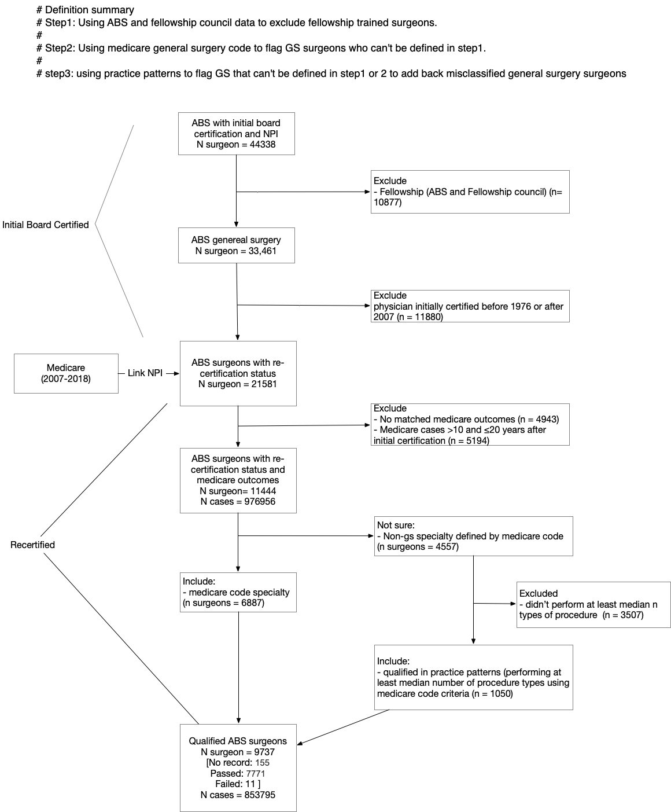

# MOC vs. Outcomes

## Summary

Association between *initial* American Board of Surgery (ABS) re-certification in ABS *US trained* *general surgeons* and risk-adjusted surgical patient outcomes. 

- Main variable: Maintenance of certification (MOC)
- Outcome: severe complication and death within 30 days
- Procedure: 162 general surgery procedures 2007 to 2018

## Data Sources

### ABS

Available MOC variables in ABS data:

- **nAttemptsReCert**:	Number of attempts of the ReCert exam on first time attempt to get recertified
- **PFfirstR**:	Pass/Fail result in first ReCert attempt
- **ReCeverPassed**:	Candidate has passed at least one ReCert exam (1), or attempted but never passed (0)

Only use certification data after 1976 and before 2017 
> They changed their process to an annual certification starting in 2018. Therefore, I think we should only analyze data until 2017, just to keep the method cleaner. We can list this as a limitation. - Andrew Jones
> ABS introduced time-limited MOC certification in 1976.

### Fellowship Council data

Use to excluded fellowship trained surgeons

### Medicare general surgery surgeons Specialty data

Based on medicare Carrier claim data, medicare general surgery surgeons are defined as surgeons that have never files any claims that are not GS specialty code.

## Cohort definition Diagram

note: included non-us graduates in the cohort. Usually we exclude these graduates. But we decided to include non-us grads based on Andrew Jones MOC paper and our research question.

### Cohort selection diagram

## Lab notebook

### Cohort selection document

1. Initial cohort definition

First attempt to define cohort. This document included the explanation of the basics of cohort criteria.

[define_cohort](code/data_prep/1_define_cohort.pdf)

2. How we defined 4 different cohort definitions 

[explore_cohort_definition](other_docs/lab_notebooks/explore_cohort_definition.pdf)

3. Compare the 4 different cohort definitions

[overlap_cohort_definitions](other_docs/lab_notebooks/Overlap_cohort_definitions.pdf)

4. Union all 4 criteria cohort definition

keynote: after excluding general surgery surgeons based on Medicare, but use practice patterns criteria to add excluded medicare gs surgeons back to cohort.

[union cohort definition](other_docs/lab_notebooks/union4_cohort_definition.pdf)

## Other

Google drive at: `Active Projects/2019.08 ABS MoC v Pt Outcomes (K08 Aim 2-2) - Brian`
Maize folder: `George_Surgeon_Projects/MOC_vs_Outcome`
