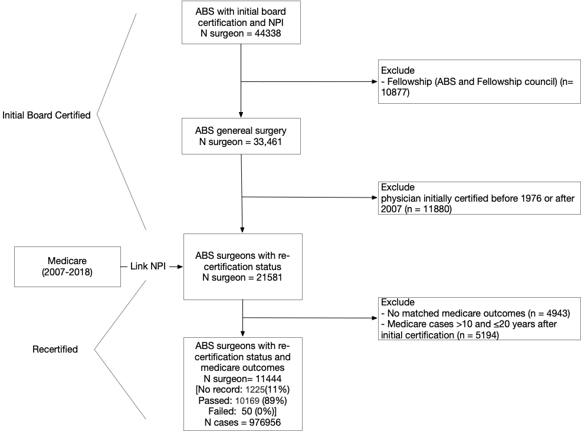

# MOC vs. Outcomes

## Summary

Association between *initial* American Board of Surgery (ABS) re-certification in ABS *US trained* *general surgeons* and risk-adjusted surgical patient outcomes. 

- Main variable: Maintenance of certification (MOC)
- Outcome: severe complication and death within 30 days
- Procedure: 162 general surgery procedures

## Dataset

### ABS

Available MOC variables in ABS data:

- **nAttemptsReCert**:	Number of attempts of the ReCert exam on first time attempt to get recertified
- **PFfirstR**:	Pass/Fail result in first ReCert attempt
- **ReCeverPassed**:	Candidate has passed at least one ReCert exam (1), or attempted but never passed (0)

Only use data used before 2017
> They changed their process to an annual certification starting in 2018. Therefore, I think we should only analyze data until 2017, just to keep the method cleaner. We can list this as a limitation. - Andrew Jones

### Cohort definition

### Cohort selection diagram

### Cohort selection document

Describes the cohort selection steps in details

[define_cohort report](code/data_prep/1_define_cohort.pdf)

## Lab notebook

### Table 1

## Other

Google drive at: `Active Projects/2019.08 ABS MoC v Pt Outcomes (K08 Aim 2-2) - Brian`
Maize folder: `George_Surgeon_Projects/MOC_vs_Outcome`
